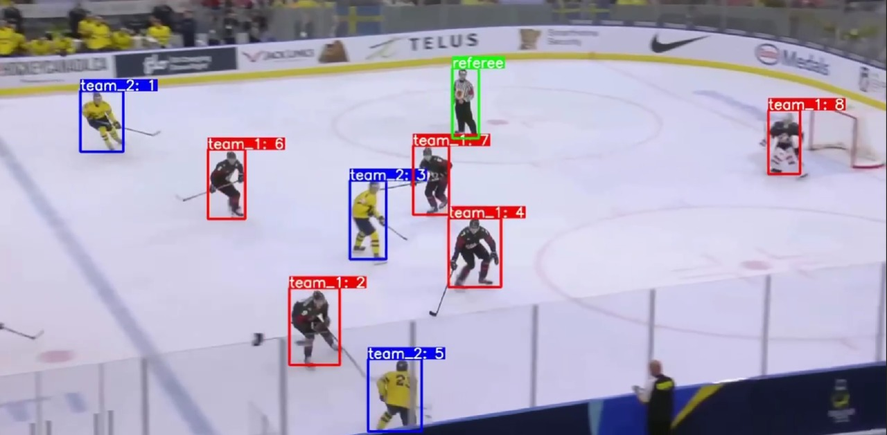

# Identifying-Players-In-Sports-Videos
An endeavour to track sports players using advanced machine learning and computer vision techniques.

Ice hockey, known for its dynamic and fast-paced nature, poses unique challenges in sports analytics. Traditional tracking methods often fall short, unable to capture the swift and complex movements that define this sport. This gap led me to develop a system that detects, classifies, and tracks ice hockey players with remarkable precision and efficiency.

Utilising the robust YOLO object detection framework combined with the sophisticated Deep SORT tracking algorithm, this system excels in player detection and tracking. Moreover, it incorporates advanced clustering techniques to distinguish between teams and referees, ensuring every player's position is monitored with remarkable accuracy

# 1. Data Collection and Preprocessing

This is a crucial part of the project, as the clarity and accuracy of these initial images form the foundation for the ability to identify objects in different contexts later on. 

By gathering and refining a large dataset of high-quality images, we ensure a diverse and extensive dataset, so that our model can learn more effectively and achieve greater accuracy in recognizing objects. 

This enhances the model's ability to generalize across different game scenarios and ensures robust performance under varied lighting and dynamic conditions of an ice hockey match

Total data instances accumulate to about 5550 images for both player and field point detections.

# 2. Player and Referee Detection with YOLO

YOLO (You Only Look Once) is a deep learning algorithm for object detection that treats detection as a single regression problem, straight from image pixels to bounding box coordinates and class probabilities. 

it is very fast and accurate, which makes it particularly suitable for applications like sports video analysis where quick and efficient processing is necessary.

# 3. Team Classification Using Clustering

In the project team classification is a critical component that involves distinguishing players of different teams and refs based on their jersey colors. This classification is crucial for deeper analytical insights such as player positioning, team strategies, and performance analysis. 

The process utilizes clustering techniques, specifically K-means clustering, applied on color features extracted from the players' jerseys

The process consists of:
1. Feature Extraction
2. K-means Clustering
3. Cluster Initialization and Iteration

# 4. Player and Referee Tracking with Deep SORT

In the project Deep SORT (Simple Online and Realtime Tracking with a Deep Association Metric) is employed to track the player movements and identities across video frames.

The process consists of:
1. Detections as the Input
2. Feature Extraction
3. Tracking with Kalman Filter
4. Data Association

# 5. 2D Rink Mapping Using Homography

Homography plays a pivotal role in translating video footage of ice hockey games into a simplified and analyzable two-dimensional representation. This transformation is crucial for subsequent analysis phases such as player movement patterns and strategic planning.

Homography is a mathematical transformation used in image processing and computer vision to project the view from one plane onto another. In the project of sports analytics, it is used to map the coordinates of players from the video plane onto a model of the rink.

Key Components of 2D Rink Mapping:

1. 2D Rink point detections
2. Field Point Detection:
3. Selection of Most Confident Points
4. Homography Matrix Computation
5. Transformation Application

# 6. Heatmap Generation

Heatmap generation is a crucial analytical tool in the project for visualizing player activity and movement patterns over the ice hockey rink. These heatmaps provide a visual representation of the density and frequency of player positions, effectively highlighting areas of high activity and strategic importance during matches

Heatmap Generation Process:

1. 2D Rink Mapping
2. Data Collection
3. Density Calculation
4. Heatmap Visualization
5. Heatmap Overlay

# Future work

The capabilities we developed go beyond mere technical excellence; they enhance the strategic aspects of the game, provide valuable insights to coaches and analysts, and increase engagement for viewers, transforming how they interact with the sport

1. Looking ahead, the focus could shift towards real-time analytics for instant strategic feedback during live matches

2. The goal is to enhance tracking in challenging real-time conditions using advanced machine learning models (Transformer-based
models)

3. Additionally, the plan is to expand the system to include more sports.

4. Expansion to Larger Datasets - expanding the dataset used for training and testing could significantly enhance the system’s robustness and generalizability.

5. User-Friendly Interface - to maximize the system’s utility, developing a user-friendly interface that allows coaches and analysts easy access to real-time data and analytics is crucial.

